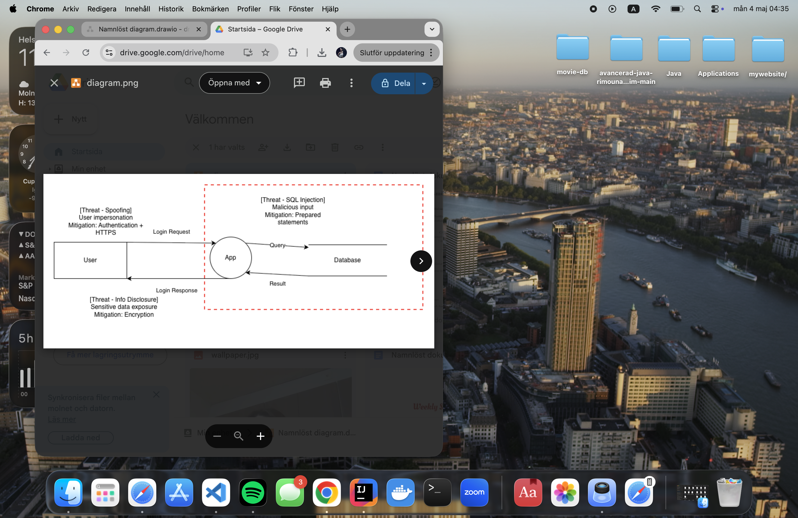

### Säkerhetsapp### 

## Beskrivning
Detta projekt är en Java-applikation där användare kan registrera sig, logga in och skicka meddelanden.  
Fokus i projektet är att förbättra säkerheten i systemet.

## Säkerhetsfunktioner
Jag har implementerat flera säkerhetslösningar:

- Lösenord lagras inte i klartext (BCrypt används)
- Meddelanden krypteras
- Rate limiting för att förhindra överbelastning
- Loggning av viktiga händelser (t.ex. inloggning)
- Stark lösenordspolicy (minst 12 tecken, siffror, specialtecken osv

## Hotmodellering
Jag har gjort en hotmodell med OWASP Threat Dragon.

Diagrammet innehåller:
- User
- App
- Database
- Dataflöden (login request/response, query, result)
- Trust boundary
- Identifierade hot + lösningar

## SBOM
Jag har genererat en SBOM med CycloneDX.

Filer finns i:
- target/bom.json
- target/bom.xml

## Tekniker
- Java
- Maven
- BCrypt
- Log4j
- CycloneDX

## Hur man kör projektet
1. Klona repot
2. Öppna i IntelliJ
3. Kör projektet

## Diagram
Threat Model
